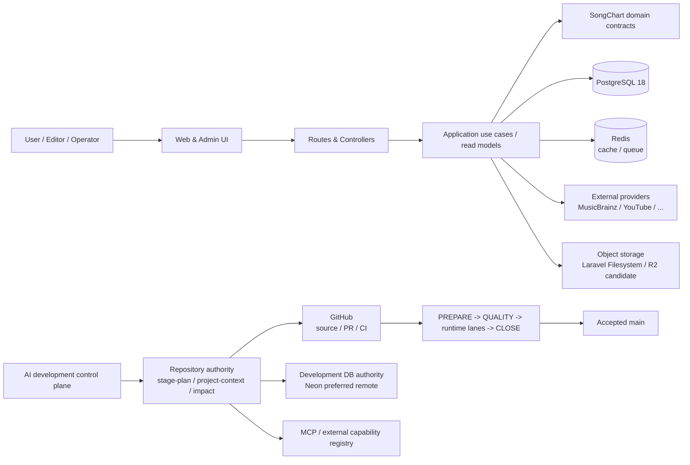
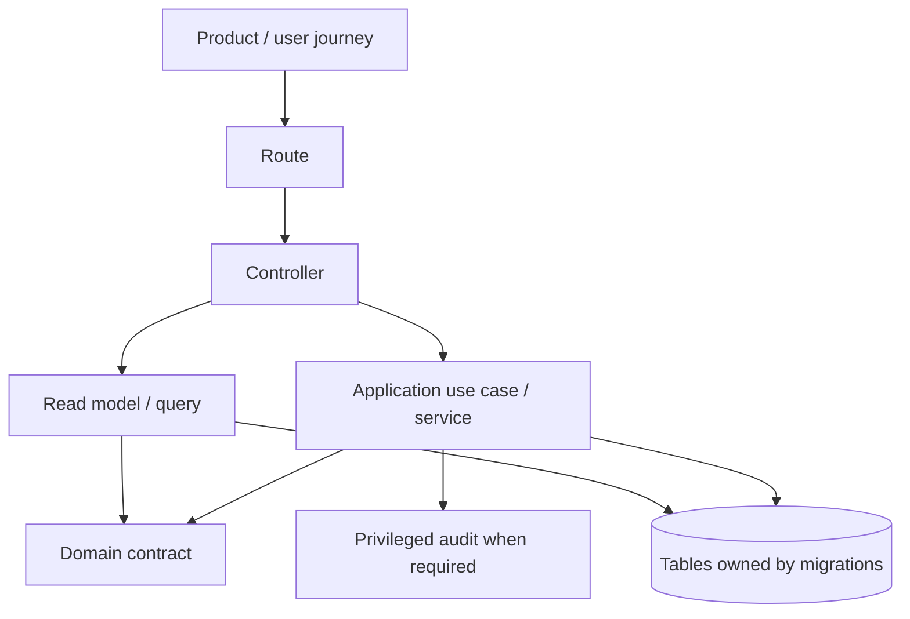
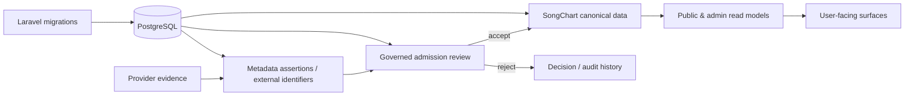
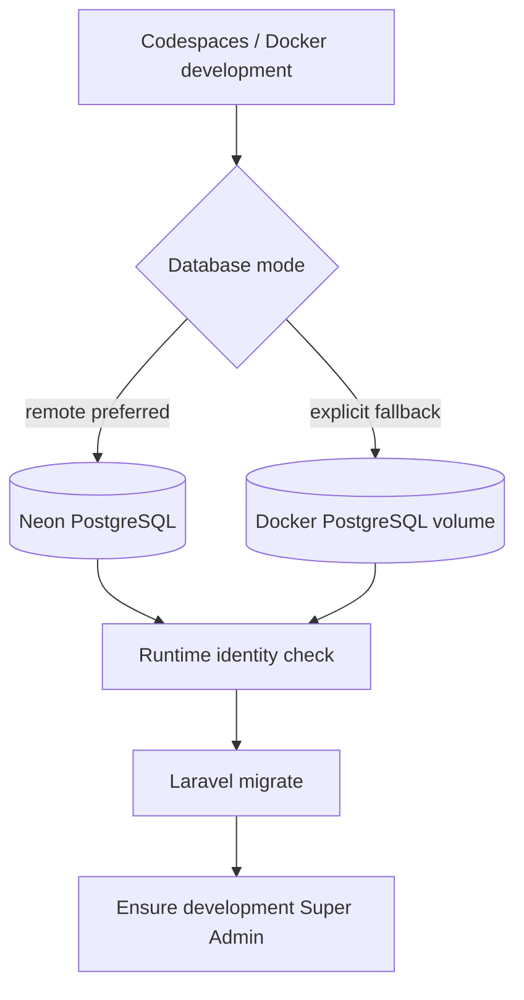
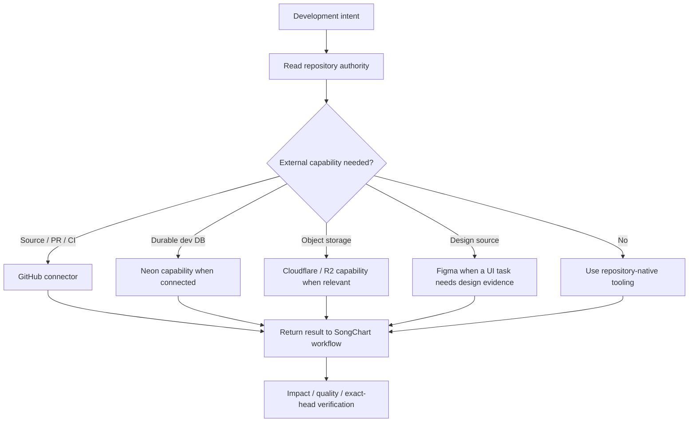
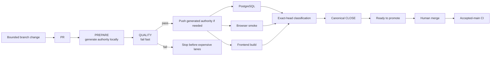

# SongChart System Atlas

> A private, human-readable navigation aid for understanding how product flows, source code, data, runtime, AI tooling and delivery fit together. Repository contracts remain authority when this overview and machine-readable owners differ.

## 1. The whole system



## 2. From product intent to code



Use these authorities when tracing a feature:

- `docs/project/domain/product-user-journeys.json` — why the surface exists.
- `docs/project/domain/use-case-contracts.json` — executable application contracts.
- `routes/` — HTTP entrypoints.
- `app/Http/Controllers/` — transport orchestration only.
- `app/Application/` — use cases and read models.
- `docs/project/domain/domain-contracts.json` — canonical domain semantics.
- `database/migrations/` — schema evolution authority.
- `docs/project/domain/schema-ownership.json` — table/domain ownership.

## 3. Data and database



Development database modes:



The remote path is preferred for continuity across Codespaces. `docs/project/engineering/development-database-contract.json` owns the exact rules; `docs/foundation/DEVELOPMENT_NEON_CODESPACES.md` explains setup without committing credentials.

## 4. AI, MCP and external systems



MCP is an adapter layer, not project authority. The current owners are:

- `docs/project/engineering/mcp-governance-contract.json`
- `docs/project/engineering/external-systems-registry.json`
- `docs/project/engineering/project-knowledge.json`

A tool should be used because an active task needs its capability, not because it happens to be installed.

## 5. Delivery and CI



Why main CI still exists after a green PR: the merge commit is a new integration SHA. SongChart currently prefers re-verification over assuming SHA equivalence. A future optimization may reuse PR evidence only when tree-equivalence provenance is proven explicitly.

## 6. UI/UX rule of thumb

Product/admin UI should speak in task language first:

```text
User goal -> understandable information -> clear consequence -> action
```

Technical implementation detail belongs behind progressive disclosure:

```text
IDs / field names / raw provider payload / commands -> "Chi tiết kỹ thuật" or developer tooling
```

For example, the editorial review surface should say **“Đề xuất cần bạn xem xét”**, **“Giá trị đề xuất”**, **“Chấp nhận và cập nhật dữ liệu”** rather than leading with `canonical admission`, `assertion`, raw ULIDs or operational shell commands.

## 7. Where to start when something breaks

| Question | First place to look |
| --- | --- |
| What stage are we implementing? | `docs/project/engineering/stage-plan.json` |
| Why does a feature exist? | `docs/project/domain/product-user-journeys.json` |
| Which route/use case owns it? | `docs/project/domain/use-case-contracts.json` + `routes/` |
| Who owns a table/schema change? | `database/migrations/` + `schema-ownership.json` |
| Which database am I connected to? | `./songchart dev db status` |
| Why did CI fail? | Auto Closure `QUALITY` first, then classified runtime lane |
| Which MCP/tool should AI use? | `external-systems-registry.json` + `mcp-governance-contract.json` |
| Is generated project state current? | `./songchart ai status --json` / reconcile workflow |

## 8. Design boundary

This Atlas is for developers/operators understanding the system. It must **not** cause product UI to expose repository commands, infrastructure jargon, internal IDs or architecture vocabulary unless the user explicitly opens technical detail.
