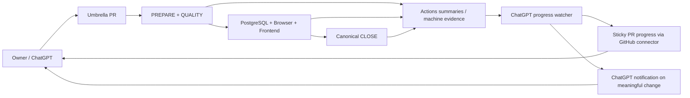

# SongChart AI Progress Workflow

## Purpose

Provide a low-friction way to follow long vibe-coding sessions without waiting for a ChatGPT response to finish and then manually sending `continue`.

GitHub is the live progress surface. Repository authority remains the source of truth for what may be changed; GitHub PRs and Actions provide volatile execution state.

## Control plane



## Authorities

- `docs/project/engineering/stage-plan.json` owns authored stage/tranche progress.
- The live Git branch and PR own volatile work-lease/head state.
- GitHub Actions own verification status for an exact SHA.
- The sticky PR comment is a projection only. It must never become repository authority.
- `docs/project/generated/*` must not store volatile GitHub run, PR, notification or exact-head state.

## Branch lifecycle

Use one umbrella branch and one umbrella PR per active stage unless a genuinely independent semantic owner requires isolated work. Do not create a branch per tranche by default.

Normal lifecycle:

```text
accepted main
    ↓
stage-N branch + draft umbrella PR
    ↓
tranche A implementation
    ↓
exact-head verification + accepted tranche checkpoint
    ↓
tranche B/C/... on the same branch
    ↓
final stage acceptance metadata
    ↓
exact-head closure
    ↓
ready-for-review / human merge
    ↓
accepted main
```

Rules:

- only one active writer owns overlapping stage source at a time;
- a new tranche starts only after the previous tranche has accepted exact-head evidence;
- accepted tranche evidence is recorded in stage authority, not represented by extra long-lived branches;
- do not merge partial tranche branches into `main` merely to reduce branch length;
- if unrelated emergency/hotfix work must occur, branch it independently from `main` and reconcile it explicitly before continuing the umbrella stage;
- resolve live PR/head state before every mutation; never rely on stale chat memory for the branch head.

## CI concurrency and generated authority

A new human/agent source commit on the same PR makes an older source-head closure obsolete. SongChart Auto Closure therefore cancels stale source-head runs automatically.

PREPARE may create and push a generated-authority commit after QUALITY succeeds. That generated push is not a new semantic source change and must not cancel the source run that created it or start a second full closure. Auto Closure therefore separates source and `github-actions[bot]` concurrency groups and skips full closure jobs for the generated refresh event.

The effective prepared SHA remains the verification authority when PREPARE generated a commit. Exact-head CHECK, canonical CLOSE and ready-to-promote all bind to that effective SHA.

Do not optimize CI by weakening these invariants. In particular:

- do not replace exact-head verification with branch-tip assumptions;
- do not allow generated files to be edited manually;
- do not skip PostgreSQL/browser/frontend owners solely to save minutes unless impact authority explicitly proves the lane is irrelevant;
- prefer cache/reuse/concurrency improvements over removing verification ownership.

## Sticky PR dashboard

An authorized ChatGPT/GitHub connector task maintains exactly one top-level PR comment containing:

```text
<!-- songchart-ai-progress -->
```

The same comment is updated instead of adding one comment per event. GitHub Actions does **not** mutate the PR comment because the repository's Actions integration can be denied that UI mutation even when a job requests issue-write permission. Actions therefore stays verification-focused and publishes step summaries/machine evidence; the connector owns the dashboard projection.

The dashboard reports:

- current stage and active tranche;
- exact SHA;
- PREPARE / QUALITY state;
- PostgreSQL, browser and frontend state;
- canonical CLOSE state;
- whether owner input is required;
- a compact machine-state JSON payload behind progressive disclosure.

Expected milestone states:

1. `runtime-verification` — PREPARE and QUALITY passed; runtime lanes are running.
2. `canonical-close` — all runtime lanes passed; canonical closure is running.
3. `verified` — exact head passed all automated gates.
4. `blocked` — an owning gate failed; implementation must not advance or merge.

## Notification policy

Notifications should be meaningful, not commit-by-commit noise.

Notify or surface prominently when:

- a tranche becomes exact-head verified;
- an automated gate becomes blocked;
- human product/UX/domain input is genuinely required;
- a stage is ready for merge/acceptance;
- accepted-main verification fails after merge.

Do not notify for:

- package installation progress;
- every individual test;
- generated-authority commits;
- stale source runs cancelled because a newer source head superseded them;
- normal queued/running transitions that do not change the owner decision.

## Daily owner workflow

### Follow progress quickly

Open the current Stage PR and read the `SongChart AI progress` comment. It is the human dashboard projection; the Actions tab remains the exact raw verification source.

### GitHub notification setup

Use the PR `Subscribe` control (or watch the repository with custom Pull request / Actions preferences) and configure GitHub web/mobile/email notification delivery to your preference. GitHub can also notify for workflow completion/failure independently of the sticky dashboard.

### When to send ChatGPT a message

You normally only need to send a new instruction when:

- you want to change product direction or priority;
- the dashboard says owner input is required;
- you want to merge/accept a consequential gate;
- you want ChatGPT to start a new tranche/stage.

Routine CI progression should not require repeated `continue` messages.

## ChatGPT Work / event-driven continuation

For longer execution sessions, prefer ChatGPT Work with the GitHub connector when available. Give one bounded instruction such as:

> Continue the active stage on the existing umbrella PR. Follow repository authority, repair self-correctable CI failures, keep the sticky progress dashboard current, and stop only for a genuine owner decision or consequential merge gate.

Eligible ChatGPT Work accounts can create event-triggered GitHub tasks for supported PR activity. When available, prefer that webhook trigger over polling. Until the event trigger is configured, the SongChart progress watcher may use a low-frequency condition watch and only notify on meaningful state transitions.

## Failure behavior

Progress publishing is observability, not verification authority. Dashboard update failures must not turn a green source/verification run red.

A verification failure remains a real workflow failure. The connector/task should project that failure into the sticky dashboard as `blocked` on its next meaningful check.

A cancelled source run is not a failure when a newer source commit superseded it. The newer exact-head run becomes the only acceptance candidate.

## Security

- Progress comments never contain secrets, database URLs, credentials or raw exception payloads.
- GitHub Actions remains read-only toward PR UI state; it does not receive issue-write or pull-request-write permission for progress publishing.
- The authorized GitHub connector may update the single progress comment but must not auto-merge, auto-approve, mark PR ready, or mutate privileged product state unless the owner explicitly requests the consequential action.
- Progress state is always re-read from the live PR and exact-head workflow before notification or continuation.
