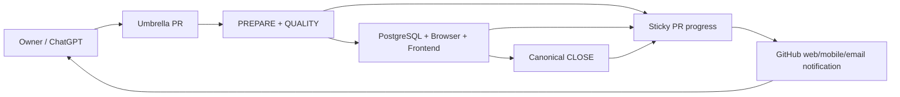

# SongChart AI Progress Workflow

## Purpose

Provide a low-friction way to follow long vibe-coding sessions without waiting for a ChatGPT response to finish and then manually sending `continue`.

GitHub is the live progress surface. Repository authority remains the source of truth for what may be changed; GitHub PRs and Actions provide volatile execution state.

## Control plane



## Authorities

- `docs/project/engineering/stage-plan.json` owns authored stage/tranche progress.
- The live Git branch and PR own volatile work-lease/head state.
- GitHub Actions own verification status for an exact SHA.
- The sticky PR comment is a projection only. It must never become repository authority.
- `docs/project/generated/*` must not store volatile GitHub run, PR, notification or exact-head state.

## Sticky PR dashboard

Auto Closure maintains exactly one top-level PR comment containing:

```text
<!-- songchart-ai-progress -->
```

The same comment is updated instead of adding one comment per event.

It reports:

- current stage and active tranche;
- exact SHA;
- PREPARE / QUALITY state;
- PostgreSQL, browser and frontend state;
- canonical CLOSE state;
- whether owner input is required;
- a compact machine-state JSON payload behind progressive disclosure.

Expected milestone states:

1. `runtime-verification` — PREPARE and QUALITY passed; runtime lanes are running.
2. `canonical-close` — all runtime lanes passed; canonical closure is running.
3. `verified` — exact head passed all automated gates.
4. `blocked` — an owning gate failed; implementation must not advance or merge.

## Notification policy

Notifications should be meaningful, not commit-by-commit noise.

Notify or surface prominently when:

- a tranche becomes exact-head verified;
- an automated gate becomes blocked;
- human product/UX/domain input is genuinely required;
- a stage is ready for merge/acceptance;
- accepted-main verification fails after merge.

Do not notify for:

- package installation progress;
- every individual test;
- generated-authority commits;
- normal queued/running transitions that do not change the owner decision.

## Daily owner workflow

### Follow progress quickly

Open the current Stage PR and read the first `SongChart AI progress` comment. The latest table is the current live status; old progress comments should not accumulate.

### GitHub notification setup

Use the PR `Subscribe` control (or watch the repository with custom Pull request / Actions preferences) and configure GitHub web/mobile/email notification delivery to your preference. The workflow updates the existing PR Conversation comment at important milestones.

### When to send ChatGPT a message

You normally only need to send a new instruction when:

- you want to change product direction or priority;
- the dashboard says owner input is required;
- you want to merge/accept a consequential gate;
- you want ChatGPT to start a new tranche/stage.

Routine CI progression should not require repeated `continue` messages.

## ChatGPT Work / event-driven continuation

For longer execution sessions, prefer ChatGPT Work with the GitHub connector when available. Give one bounded instruction such as:

> Continue Stage 21 on the existing umbrella PR. Follow repository authority, repair self-correctable CI failures, keep the sticky progress dashboard current, and stop only for a genuine owner decision or consequential merge gate.

A GitHub-triggered ChatGPT task may be added when the product/account exposes an authorized GitHub event trigger. It should react only to meaningful PR/CI transitions and must read the live PR/source before acting. Do not replace this with high-frequency polling.

## Failure behavior

Progress publishing is observability, not verification authority. Comment update failures are best-effort and must not turn a green source/verification run red.

A verification failure, however, must update the sticky dashboard to `blocked` when GitHub permits the comment mutation and must remain a real workflow failure.

## Security

- Progress comments never contain secrets, database URLs, credentials or raw exception payloads.
- The progress jobs receive `issues: write` only to update the PR Conversation comment.
- They do not receive `contents: write` or `pull-requests: write` unless another independently governed job requires it.
- Progress automation must never auto-merge, auto-approve, mark PR ready, or mutate privileged product state.
